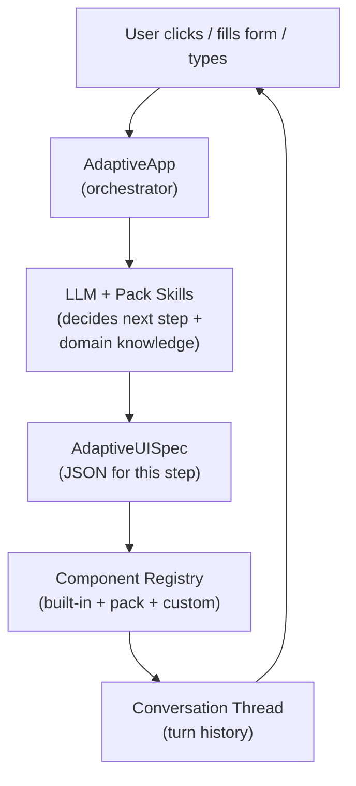

# Adaptive UI Framework

<p align="left">
  
</p>

[](https://github.com/sabbour/adaptive-ui-framework/actions/workflows/ci.yml)

A React framework for building **conversational, agent-driven UIs** powered by LLMs. An AI agent drives a multi-turn conversation — asking questions, presenting forms, choices, and interactive components — dynamically generating the next step based on user responses.

## How It Works



## Quick Start

```bash
npm install
npm run dev
```

The demo starts with a mock adapter (no API key needed). Click the ⚙ gear icon to connect your OpenAI-compatible LLM endpoint.

## Core Concepts

### Conversation Turns

Each interaction is a **turn**: the user's action + the agent's response. Past turns are collapsed; the latest turn is interactive.

### AdaptiveUISpec

JSON the LLM produces for each turn:

```json
{
  "version": "1",
  "title": "Step Title",
  "agentMessage": "What the agent says in natural language",
  "layout": { "type": "container", "children": [...] },
  "state": { "selectedOption": "" },
  "theme": { "primaryColor": "#2563eb" }
}
```

### Component Registry

Maps `type` strings to React components. Ships with **24 built-in components**. Register your own or install packs.

### Component Packs

Bundles of components + LLM knowledge + settings UI that extend the framework:

```typescript
import { registerPackWithSkills } from './framework/registry';
import { createAzurePack } from './packs/azure';

registerPackWithSkills(createAzurePack());
```

A pack can provide:
- **Components** — custom UI types the LLM can use
- **System prompt** — teaches the LLM about the pack's capabilities
- **Knowledge skills** — fetched on demand based on conversation context
- **Settings UI** — injected into the settings panel automatically

## Minimal App

```tsx
import React from 'react';
import ReactDOM from 'react-dom/client';
import { AdaptiveApp, OpenAIAdapter } from './framework';

const adapter = new OpenAIAdapter({
  apiKey: 'sk-...',
  model: 'gpt-4o',
});

ReactDOM.createRoot(document.getElementById('root')!).render(
  <AdaptiveApp adapter={adapter} />
);
```

That's it. The agent will show a chat input and start the conversation.

## Built-in Components (24)

### Layout
| Type | Props | Description |
|------|-------|-------------|
| `container` | `children` | Layout wrapper, supports flex/grid via `style` |
| `card` | `title`, `subtitle`, `children`, `onClick` | Clickable card sections |
| `tabs` | `tabs: [{label, id, children}]` | Tabbed content |
| `divider` | `label?` | Horizontal separator, optionally labeled |
| `accordion` | `items: [{label, id, children}]` | Collapsible sections |

### Text & Media
| Type | Props | Description |
|------|-------|-------------|
| `text` | `content`, `variant` | Headings, body, caption, code |
| `markdown` | `content` | Rich markdown text |
| `image` | `src`, `alt` | Images |
| `codeBlock` | `code`, `language?` | Syntax-highlighted code with copy button |
| `link` | `label`, `href`, `external?` | Clickable links |
| `badge` | `content`, `color` | Colored status tags |

### Inputs
| Type | Props | Description |
|------|-------|-------------|
| `input` | `bind`, `inputType`, `label`, `placeholder` | Text, number, email, textarea, date |
| `select` | `bind`, `options`, `label` | Dropdown |
| `radioGroup` | `bind`, `options` (with descriptions) | Single choice cards |
| `multiSelect` | `bind`, `options` (with descriptions) | Multi-choice checkboxes |
| `toggle` | `bind`, `label`, `description` | On/off switch |
| `slider` | `bind`, `min`, `max`, `step`, `label` | Range slider |
| `chatInput` | `placeholder` | Free-text prompt input |

### Actions & Data
| Type | Props | Description |
|------|-------|-------------|
| `button` | `label`, `variant`, `onClick`, `disabled` | Action buttons |
| `form` | `children`, `onSubmit` | Form submission wrapper |
| `list` | `items`, `itemTemplate` | Dynamic lists |
| `table` | `columns`, `rows` | Data tables |
| `progress` | `value`, `max`, `label` | Progress bars |
| `alert` | `severity`, `title`, `content` | Info/success/warning/error messages |

## Actions

```json
{ "type": "sendPrompt", "prompt": "User selected {{state.option}}" }
{ "type": "setState", "state": { "count": 5 } }
{ "type": "submit", "prompt": "Form data: {{state.email}}" }
{ "type": "custom", "name": "deploy", "payload": { "target": "prod" } }
```

## State & Interpolation

Use `{{state.key}}` in any string to interpolate state values. In lists, use `{{item.key}}`.

## LLM Configuration

The ⚙ settings panel supports any OpenAI-compatible endpoint:
- **OpenAI** — leave endpoint blank
- **Azure OpenAI** — `https://your-resource.openai.azure.com/openai/v1/chat/completions`
- **Azure AI Foundry** — `https://your-resource.services.ai.azure.com/api/projects/your-project`
- **Ollama / LM Studio** — `http://localhost:11434/v1/chat/completions`

Settings persist in `localStorage`. Auto-connects on reload if configured.

## Component Packs

### Creating a Pack

```typescript
import type { ComponentPack } from './framework/registry';

const myPack: ComponentPack = {
  name: 'my-pack',
  displayName: 'My Pack',
  components: { myWidget: MyWidgetComponent },
  systemPrompt: '- "myWidget": { bind, someProp } — Description...',
  resolveSkills: async (prompt) => { /* fetch domain knowledge */ },
  settingsComponent: MyPackSettings,
};
```

### Azure Pack (included)

The Azure pack (`src/packs/azure/`) demonstrates all pack features:

- **`azureLogin`** — inline sign-in card (MSAL popup → ARM token)
- **`azureResourceForm`** — dynamically generates forms from ARM resource provider metadata
- **`azurePicker`** — client-side dropdown fetching from ARM API (regions, resource groups, SKUs)
- **`azureQuery`** — ARM API caller for write operations with confirm dialog
- **Knowledge skills** — fetches Azure docs from the [agent-skills catalog](https://github.com/MicrosoftDocs/agent-skills)
- **`azure_arm_get` tool** — LLM reads ARM API data during inference
- **Settings UI** — sign-in/sign-out injected into the settings panel

### GitHub Pack (included)

- **`githubLogin`** — OAuth Device Flow sign-in
- **`githubPicker`** — org/repo/branch pickers with auto-pagination
- **`githubQuery`** — write operations (create repos, branches) with confirm dialog
- **`githubCreatePR`** — commits generated artifacts and opens a PR
- **`github_api_get` tool** — LLM reads GitHub API during inference

### Google Maps Pack (included)

- **`googleMaps`** — embedded maps (place, search, directions, view, streetview modes)
- **`googlePlacesSearch`** — place search with selectable results
- **`googleNearby`** — photo grid of nearby places with ratings and price levels
- **`googlePhotoCard`** — hero photo card with place info overlay
- **`google_places_search` / `google_place_details` / `google_geocode` tools**

### Google Flights Pack (included)

- **`flightSearch`** — live flight results or Google Flights deep link (protobuf-encoded URL)
- **`flightCard`** — styled link card for itinerary summaries
- **`search_flights` tool** — real prices/schedules for LLM recommendations

### Travel Data Pack (included)

- **`weatherCard`** — visual weather forecast with 3-day strip
- **`countryInfoCard`** — country facts with flag, capital, languages, currency
- **`currencyConverter`** — interactive converter widget with live rates
- **`travelChecklist`** — checkable packing/prep list with progress bar
- **`get_weather` / `get_exchange_rate` / `get_country_info` / `get_time_zone` tools**

## Demo Apps

| App | Packs | Description |
|-----|-------|-------------|
| **Solution Architect** | Azure, GitHub | AI coworker for cloud-native architecture design + IaC + CI/CD |
| **Travel Concierge** | Travel Data, Google Maps, Google Flights | AI travel advisor with maps, flights, weather, and real place data |

## Crash Recovery

Conversation turns persist to `localStorage` with a 24-hour TTL:

```tsx
<AdaptiveApp adapter={adapter} persistKey="my-session" />
```

## Project Structure

```
src/
├── framework/                     # Reusable framework
│   ├── index.ts                   # Public API
│   ├── schema.ts                  # Types
│   ├── registry.ts                # Component registry + ComponentPack
│   ├── renderer.tsx               # Recursive node renderer
│   ├── context.tsx                # React context, state, actions
│   ├── interpolation.ts           # {{state.key}} resolution
│   ├── llm-adapter.ts             # OpenAI adapter + system prompt
│   ├── AdaptiveApp.tsx            # Conversation orchestrator
│   └── components/
│       ├── builtins.tsx            # 24 built-in components
│       └── ConversationThread.tsx  # Memoized turn thread
├── packs/
│   ├── azure/                     # Azure cloud pack
│   ├── github/                    # GitHub pack
│   ├── google-maps/               # Google Maps + Places pack
│   ├── google-flights/            # Google Flights pack
│   └── travel-data/               # Weather, currency, country info pack
└── demo/
    ├── SolutionArchitectApp.tsx    # Solution Architect demo
    └── TravelApp.tsx              # Travel Concierge demo
```

## Extending

1. **Custom components** — `registerComponent('chart', ChartComponent)`
2. **Component packs** — Bundle components + LLM context + settings
3. **Custom LLM adapter** — Implement `LLMAdapter` interface
4. **Custom actions** — `onCustomAction` prop on `AdaptiveApp`
5. **Theming** — `theme` prop or per-spec
6. **State access** — `useAdaptive()` hook in custom components

## Scaffolding with Copilot

This repo includes built-in VS Code Copilot customizations to quickly create packs and components:

| Command | What it does |
|---------|--------------|
| `/add-pack <name> — <description>` | Scaffolds a complete pack (directory, components, system prompt, registration) |
| `/add-component <name> — <description>` | Scaffolds a built-in component (schema, implementation, registration, compact mappings) |

Additional customizations: a **component-authoring skill** (loaded automatically for component tasks), an **azure-pack-dev agent** (specialized for Azure pack work), and **auto-applied instructions** that enforce codebase conventions when editing `builtins.tsx`, `schema.ts`, or any `src/**` file.

See [docs/onboarding.md](docs/onboarding.md#fast-track-creating-packs--components-with-copilot) for full details.

