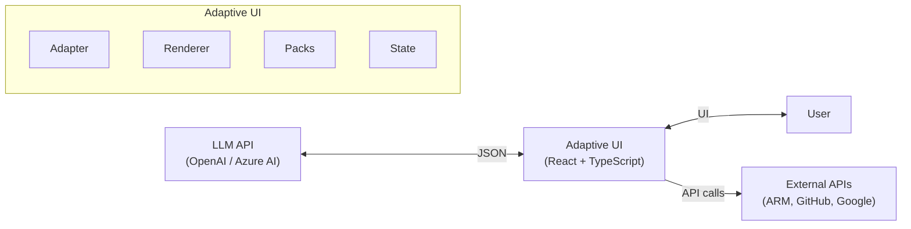

# Adaptive UI — Architecture Overview

## What Is Adaptive UI?

Adaptive UI is a React + TypeScript framework for building **conversational, AI-agent-driven user interfaces** powered by Large Language Models (LLMs). Instead of hand-coding every screen, the LLM orchestrates multi-turn conversations and dynamically generates JSON specifications (`AdaptiveUISpec`) that the client renders into interactive components.

The framework sits between the LLM and the user — it translates structured JSON from the model into live React components, collects user input, and sends it back for the next turn.

## System Context



## Two Operating Modes

Adaptive UI supports two modes of LLM interaction, selectable per-app:

### 1. Full-Spec Mode (default)

The LLM outputs a complete `AdaptiveUISpec` JSON with layout trees, component types, and props. Maximum control, but higher token cost.

```
User action → LLM → AdaptiveUISpec (JSON) → Component Registry → Renderer → UI
```

### 2. Intent Mode (token-efficient)

The LLM outputs a compact `AgentIntent` with semantic `ask`/`show` arrays. The client resolves these into full specs. ~40-60% fewer output tokens.

```
User action → LLM → AgentIntent (JSON) → Intent Resolver → AdaptiveUISpec → Renderer → UI
```

Enable with `useIntents: true` in adapter config.

## High-Level Module Map

```
src/
├── framework/                    # Core runtime
│   ├── schema.ts                 # Type system (AdaptiveUISpec, AdaptiveNode, 23 node types)
│   ├── context.tsx               # React Context + state management (useAdaptive, dispatch)
│   ├── renderer.tsx              # Recursive tree → React reconciler
│   ├── registry.ts               # Component registry + pack system
│   ├── llm-adapter.ts            # LLM bridge (OpenAI/Azure, tool-call loop, prompt assembly)
│   ├── intent-schema.ts          # Intent vocabulary (AskIntent, ShowIntent, AgentIntent)
│   ├── intent-resolver.ts        # Intent → AdaptiveUISpec resolution
│   ├── compact.ts                # Abbreviated JSON notation (~40% token savings)
│   ├── interpolation.ts          # {{state.key}} / {{item.key}} template engine
│   ├── sanitize.ts               # XSS prevention (URLs, CSS, interpolation)
│   ├── tools.ts                  # Tool registry + built-in fetch_webpage
│   ├── artifacts.ts              # Code/file artifact persistence
│   ├── session-manager.ts        # Multi-session conversation persistence
│   ├── decision-log.ts           # Pipeline decision tracing
│   ├── request-tracker.ts        # HTTP activity monitoring
│   ├── AdaptiveApp.tsx            # Top-level orchestrator + settings panel
│   ├── app-router.tsx            # URL hash-based multi-app router
│   ├── app-registry.ts           # App discovery registry
│   └── components/
│       ├── builtins.tsx           # 24 built-in UI components
│       ├── ConversationThread.tsx # Turn history + active turn + debug panel
│       ├── FilesPanel.tsx         # Artifact browser + GitHub PR integration
│       ├── ArchitectureDiagram.tsx# Mermaid rendering with cloud icons
│       ├── SessionsSidebar.tsx    # Session list + file list sidebar
│       └── FileViewer.tsx         # Code/diagram viewer
│
├── packs/                        # Extension bundles
│   ├── azure/                    # Azure cloud pack (ARM, MSAL, Bicep)
│   ├── github/                   # GitHub pack (OAuth, repos, PRs)
│   ├── google-maps/              # Google Maps + Places pack
│   ├── google-flights/           # Google Flights pack (protobuf)
│   └── travel-data/              # Travel data pack (weather, currency, country)
│
└── demo/
    ├── SolutionArchitectApp.tsx   # Solution Architect demo app
    └── TravelApp.tsx             # Travel Concierge demo app
```

## Key Design Principles

### 1. LLM as Orchestrator, Not Renderer
The LLM decides *what* to show (data, options, layout). Registered components decide *how* to render. This separation prevents the LLM from needing to know CSS, HTML, or React.

### 2. Token Efficiency by Design
- Compact JSON notation saves ~40% on every response
- Intent mode reduces output tokens by 40-60%
- Picker components keep API data client-side (zero LLM token cost)
- History auto-compacts when prompt tokens exceed 80k
- Skills inject domain knowledge only when relevant

### 3. Defense in Depth
- All LLM-produced specs pass through `sanitize.ts` before render
- Sensitive state keys (`__` prefix) are filtered from LLM context
- URLs block `javascript:` and other dangerous protocols
- CSS strips `expression()` injection vectors
- Tool results are sandboxed strings

### 4. Graceful Degradation
- Truncated JSON is repaired (closing open braces)
- Unknown component types are inferred from props or shown as placeholders
- LLM component name aliases are normalized (e.g., `radioGroup` → `choice`)
- Non-JSON responses display in the agent bubble rather than crashing

### 5. Extension Without Modification
The Pack system allows adding new capabilities (components, tools, prompts, intent resolvers) without modifying framework code. Packs are self-contained bundles registered at startup.

## Technology Stack

| Layer | Technology |
|---|---|
| UI Framework | React 18 (createElement style, no JSX in framework code) |
| Language | TypeScript (ES2020 target) |
| Build | Vite (dev server + production bundling) |
| Auth | MSAL.js (Azure), OAuth Device Flow (GitHub) |
| Diagrams | Mermaid.js |
| LLM APIs | OpenAI Chat Completions (with tool calling) |
| Persistence | localStorage (sessions, artifacts, settings) |

## Next Steps

- [Component Model](02-component-model.md) — How components are defined, registered, and rendered
- [LLM Integration Pipeline](03-llm-pipeline.md) — Request lifecycle from user input to rendered UI
- [Pack System](04-pack-system.md) — Extension architecture and the tool/picker/query taxonomy
- [Data Flow & State](05-data-flow.md) — State management, interpolation, and security
