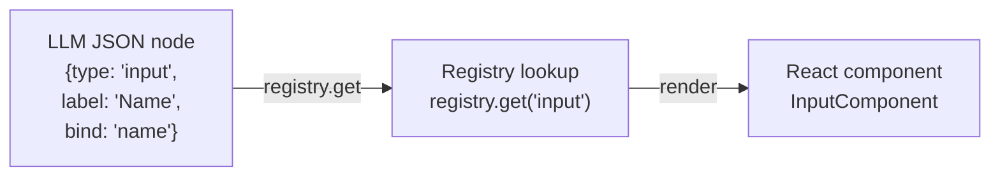

# Component Model

## Overview

Adaptive UI uses a **type-driven component registry**. Every UI element the LLM can produce is identified by a string `type` key (e.g., `"text"`, `"radioGroup"`, `"chatInput"`) mapped to a React component in a global registry.



## Type System

### AdaptiveNodeBase

Every node type extends `AdaptiveNodeBase`, the common interface:

```typescript
interface AdaptiveNodeBase {
  type: string;           // Component type key
  id?: string;            // Unique node ID
  style?: AdaptiveStyle;  // CSS subset (flexbox, spacing, typography)
  className?: string;     // CSS class name
  visible?: string | boolean;  // Conditional visibility via state
  props?: Record<string, unknown>;  // Forward-compatible arbitrary props
}
```

### The 23 Built-in Node Types

| Category | Types | Purpose |
|---|---|---|
| **Layout** | `container`, `card`, `tabs`, `accordion` | Structural containers |
| **Text/Media** | `text`, `markdown`, `image`, `codeBlock` | Content display |
| **Inputs** | `input`, `select`, `radioGroup`, `multiSelect`, `toggle`, `slider`, `chatInput` | User data collection |
| **Data** | `form`, `list`, `table` | Structured data display/collection |
| **Feedback** | `alert`, `progress`, `badge` | Status and notifications |
| **Navigation** | `button`, `link`, `divider` | Actions and structure |

All 23 types form the `AdaptiveNode` discriminated union in `schema.ts`:

```typescript
type AdaptiveNode =
  | TextNode | ButtonNode | InputNode | SelectNode
  | RadioGroupNode | MultiSelectNode | ToggleNode | SliderNode
  | ContainerNode | CardNode | TabsNode | FormNode
  | ListNode | TableNode | ProgressNode | AlertNode
  | BadgeNode | DividerNode | ChatInputNode | MarkdownNode
  | ImageNode | CodeBlockNode | LinkNode | AccordionNode;
```

### AdaptiveUISpec

The top-level response structure from the LLM:

```typescript
interface AdaptiveUISpec {
  version: string;
  agentMessage: string;     // Natural language explanation
  title?: string;           // Step title
  layout: AdaptiveNode;     // Root of the component tree
  state?: Record<string, AdaptiveValue>;  // Initial state values
  theme?: AdaptiveTheme;    // Visual theme overrides
}
```

## Component Registration

### Built-in Components

All 24 built-in components are implemented in `builtins.tsx` and registered at startup:

```typescript
// Registration (bottom of builtins.tsx)
registerComponent('text', TextComponent);
registerComponent('button', ButtonComponent);
registerComponent('input', InputComponent);
// ... 21 more
```

### Pack Components

Packs register additional components during `registerPackWithSkills()`:

```typescript
// Azure pack registers 4 components
components: {
  azureLogin: AzureLogin,
  azureResourceForm: AzureResourceForm,
  azureQuery: AzureQuery,
  azurePicker: AzurePicker,
}
```

### Custom App Components

Any app can register components directly:

```typescript
registerComponent('myCustomWidget', MyCustomWidget);
```

## Component Implementation Pattern

Every component follows the same contract:

```typescript
function MyComponent({ node }: AdaptiveComponentProps<MyNodeType>) {
  const { state, dispatch } = useAdaptive();

  // Read state
  const value = state[node.bind] ?? node.defaultValue ?? '';

  // Update state
  const handleChange = (newValue: string) => {
    dispatch({ type: 'SET', key: node.bind, value: newValue });
  };

  // Render (React.createElement, not JSX)
  return React.createElement('div', { style: node.style },
    React.createElement('label', null, node.label),
    React.createElement('input', {
      value,
      onChange: (e) => handleChange(e.target.value),
    })
  );
}
```

Key conventions:
- Receives `{ node }` prop typed as `AdaptiveComponentProps<T>`
- Uses `useAdaptive()` for state access and dispatch
- Uses `React.createElement()` (not JSX) in all framework code
- Calls `renderChildren(node.children)` for nested content

## The Rendering Pipeline

`AdaptiveRenderer` in `renderer.tsx` recursively processes the node tree:

```
For each node:
  1. Check visibility     →  resolve {{state.key}} in `visible` prop
  2. Interpolate          →  deep-replace {{state.key}} / {{item.key}} in all string props
  3. Unwrap component     →  handle { type: "component", component: "name" } wrapper
  4. Registry lookup      →  getComponent(node.type)
  5. Fallback inference   →  if type unknown, infer from props shape
  6. Render               →  React.createElement(Component, { node })
```

### Fallback Inference

When the LLM outputs a node with a missing or unknown type, the renderer inspects the props and infers the correct component:

| Props Present | Inferred Type |
|---|---|
| `tabs` array | `tabs` |
| `children` array | `container` |
| `options` + `bind` | `radioGroup` or `select` (by option count) |
| `code` or `language` | `codeBlock` |
| `content` (string) | `text` |
| `bind` (no options) | `input` |

This tolerance prevents crashes when the LLM makes minor mistakes.

## State Binding

Components bind to state via the `bind` prop:

```
LLM: { type: "input", bind: "userName", label: "Name" }
                         │
                         ▼
State store: { userName: "Alice" }
                         │
                         ▼
UI: Input field showing "Alice", updates state on change
```

The binding pattern:
1. **Read**: Component reads `state[node.bind]` via `useAdaptive()`
2. **Write**: Component dispatches `{ type: 'SET', key: node.bind, value: newValue }`
3. **Flow**: State updates trigger re-render, new value reflected in UI
4. **Continue**: When user clicks "Continue", current state is sent to LLM for next turn

## Actions

Components can trigger actions via `handleAction()` from `useAdaptive()`:

```typescript
interface AdaptiveAction {
  type: 'sendPrompt' | 'setState' | 'navigate' | 'submit' | 'custom';
  prompt?: string;      // For sendPrompt
  key?: string;         // For setState
  value?: AdaptiveValue; // For setState
  url?: string;         // For navigate
}
```

Buttons commonly use `sendPrompt` to advance the conversation:

```json
{
  "type": "button",
  "label": "Continue",
  "action": {
    "type": "sendPrompt",
    "prompt": "User selected: region={{state.region}}, tier={{state.tier}}"
  }
}
```

## Conditional Visibility

Any node can have a `visible` prop that references state:

```json
{
  "type": "input",
  "label": "Custom domain",
  "bind": "customDomain",
  "visible": "{{state.useCustomDomain}}"
}
```

The renderer resolves `visible` against current state. If falsy, the node is skipped entirely (not hidden — removed from the tree).

## Template Interpolation

All string props support `{{state.key}}` and `{{item.key}}` templates:

```json
{
  "type": "text",
  "content": "Hello, {{state.userName}}! You selected {{state.region}}."
}
```

Inside `list` components, `{{item.key}}` references the current item and `{{item._index}}` gives the 0-based index.

## Compact Notation

The LLM outputs abbreviated JSON to save tokens. The client expands it before rendering:

```json
// LLM output (compact)
{"m":"Pick a region","ly":{"t":"ctr","ch":[{"t":"rg","l":"Region","b":"region","o":[{"l":"East US","val":"eastus"}]}]}}

// Expanded by client
{"agentMessage":"Pick a region","layout":{"type":"container","children":[{"type":"radioGroup","label":"Region","bind":"region","options":[{"label":"East US","value":"eastus"}]}]}}
```

Key abbreviations: `t=type`, `ch=children`, `l=label`, `b=bind`, `o=options`, `m=agentMessage`, `ly=layout`, `s=style`, `val=value`.

## Adding a New Component

1. Define the node type interface in `schema.ts` (extend `AdaptiveNodeBase`)
2. Add to the `AdaptiveNode` union
3. Implement in `builtins.tsx` using `React.createElement()`
4. Register with `registerComponent("typeName", Component)`
5. Add compact key mappings in `compact.ts` if needed
6. If it maps to a semantic intent, add a case in `intent-resolver.ts` and aliases in `ASK_TYPE_ALIASES`
