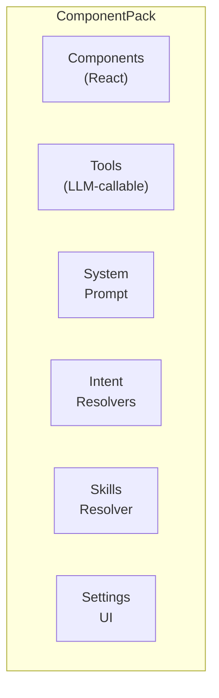
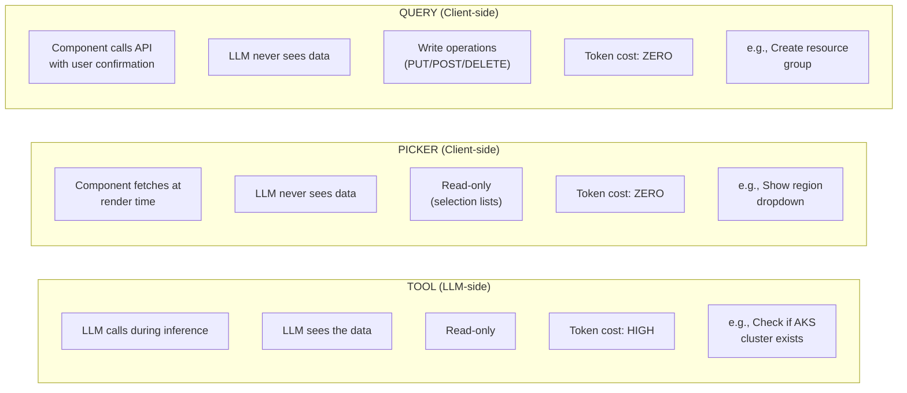

# Pack System — Extension Architecture

## Overview

A **Pack** is a self-contained extension bundle that adds domain-specific capabilities to Adaptive UI without modifying the framework. Packs bundle components, LLM system prompts, tools, intent resolvers, settings UI, and domain knowledge skills into a single registerable unit.



## Pack Interface

```typescript
interface ComponentPack {
  name: string;
  displayName?: string;

  // UI components registered in the global registry
  components: Record<string, ComponentFactory>;

  // Concatenated into the LLM system prompt
  systemPrompt: string;

  // Async startup (e.g., fetch API metadata)
  initialize?: () => Promise<Record<string, ComponentFactory>>;

  // Domain knowledge fetched per-turn based on topic detection
  resolveSkills?: (prompt: string) => Promise<string | null>;

  // Settings panel section
  settingsComponent?: React.ComponentType;

  // Custom ask types for intent mode
  intentResolvers?: Record<string, IntentResolverEntry>;

  // Functions the LLM can call during inference
  tools?: Array<{
    definition: ToolDefinition;
    handler: (args: Record<string, unknown>) => Promise<string>;
  }>;
}
```

## Registration

```typescript
// In main.tsx or app startup
const azurePack = createAzurePack();
await registerPackWithSkills(azurePack);
```

Registration performs:
1. Register all `components` in the global component registry
2. Store `systemPrompt` for LLM prompt assembly
3. Run `initialize()` if provided (may register additional components)
4. Register each `intentResolver` with the intent resolver registry
5. Register each `tool` with the tool system
6. Store `settingsComponent` for the settings panel
7. Store `resolveSkills` for per-turn domain knowledge injection

## The Tool / Picker / Query Taxonomy

This is the most important architectural decision in the Pack system. Every API interaction falls into one of three categories:



### When to Use Each

| Scenario | Use | Why |
|---|---|---|
| LLM needs to **reason** about API data | **Tool** | LLM must see the data to make decisions |
| User needs to **pick from a list** | **Picker** | Data stays client-side, zero tokens |
| User needs to **create/update/delete** | **Query** | Requires confirmation, result in state |
| Show existing resource properties | **Tool** | LLM analyzes and advises |
| List regions/SKUs/repos for selection | **Picker** | Never waste tokens on lists |
| Deploy infrastructure | **Query** | User must confirm writes |

### Anti-Patterns

**Anti-Pattern 1: Tool for selection lists**
```
BAD:  LLM calls azure_arm_get to list 50 regions → 3,000 tokens wasted
      → then puts them in a select dropdown
GOOD: LLM emits { type: "azurePicker", api: "...locations...", bind: "region" }
      → client fetches at render time, zero token cost
```

**Anti-Pattern 2: Tool description mentions listing**
```
BAD:  "List all repositories for an organization"
      → LLM will call the tool instead of emitting a picker
GOOD: "Read repository details. Do NOT use for listing — use githubPicker instead."
```

**Anti-Pattern 3: Query for reads**
```
BAD:  azureQuery with method: "GET" to list resources
      → user sees "N items loaded" but no list appears
GOOD: Use azurePicker for list display, or tool if LLM needs the data
```

## Reference Implementations

### Azure Pack

```
src/packs/azure/
├── index.ts              # createAzurePack() — pack definition + system prompt
├── components.tsx         # AzureLogin, AzurePicker, AzureQuery, AzureResourceForm
├── auth.ts               # MSAL popup authentication
├── arm-introspection.ts   # ARM schema discovery (regions, SKUs, resource types)
├── skills-resolver.ts     # ARM PUT body templates injected on demand
├── AzureSettings.tsx      # Settings panel section
├── diagram-icons.ts       # 36 Azure service icons for Mermaid diagrams
└── icon-resolver.ts       # Resolve resource types to icon URLs
```

**Components:**

| Component | Type | Purpose |
|---|---|---|
| `azureLogin` | Auth | MSAL popup sign-in, auto-fetches subscriptions, stores `__azureToken` |
| `azurePicker` | Picker | Searchable dropdown fetching from ARM API at render time |
| `azureQuery` | Query | Generic ARM API caller with confirmation for writes |
| `azureResourceForm` | Dynamic | Auto-generates forms from ARM resource type schemas |

**Tool:**

| Tool | Purpose |
|---|---|
| `azure_arm_get` | Read-only ARM API caller for data the LLM needs to reason about |

**Intent Resolvers:**

| Type | Purpose |
|---|---|
| `azure-regions` | Physical region picker (filters by `metadata.regionType`) |
| `azure-resource-groups` | RG picker scoped to subscription |
| `azure-subscriptions` | Subscription picker with auto-select for single |
| `azure-skus` | Resource-specific SKU picker |

**Skills Resolver:**

Triggered by keywords like "deploy", "create", "provision", "RBAC". Injects minimal ARM PUT body templates for:
- AKS clusters, App Service, Container Apps, ACR
- Storage Accounts, Key Vault, Role Assignments

### GitHub Pack

```
src/packs/github/
├── index.ts              # createGitHubPack() — pack definition + system prompt
├── components.tsx         # GitHubLogin, GitHubPicker, GitHubQuery, GitHubRepoInfo, GitHubCreatePR
├── auth.ts               # OAuth Device Flow + PAT authentication
└── GitHubSettings.tsx     # Settings panel section
```

**Components:**

| Component | Type | Purpose |
|---|---|---|
| `githubLogin` | Auth | OAuth Device Flow or PAT, stores `__githubToken` |
| `githubPicker` | Picker | Searchable dropdown for orgs, repos, branches (auto-paginates) |
| `githubQuery` | Query | Generic GitHub API caller with confirmation for writes |
| `githubRepoInfo` | Display | Rich repo card (stars, forks, language) |
| `githubCreatePR` | Action | Commits artifact files as a GitHub pull request |

**Tool:**

| Tool | Purpose |
|---|---|
| `github_api_get` | Read-only GitHub API caller, auto-paginates, slims responses |

**Intent Resolvers:**

| Type | Purpose |
|---|---|
| `github-orgs` | Org picker with personal account option |
| `github-repos` | Repo picker sorted by update date |

## Dual-Mode Support

Packs must work in **both** Intent mode and Full-Spec (Adaptive) mode:

### Intent Mode
The LLM uses registered intent types. The intent resolver maps them to pack components:

```json
// LLM output
{ "type": "azure-regions", "key": "region", "label": "Azure Region" }

// Resolved by intent resolver → azurePicker component
```

### Full-Spec (Adaptive) Mode
Intent resolvers don't fire. The LLM follows the pack system prompt directly and emits component nodes:

```json
// LLM output
{
  "type": "azurePicker",
  "api": "/subscriptions/{{state.__azureSubscription}}/locations?api-version=2022-12-01",
  "bind": "region",
  "label": "Azure Region",
  "labelKey": "displayName",
  "valueKey": "name",
  "filterKey": "metadata.regionType",
  "filterValue": "Physical"
}
```

This is why pack system prompts must include **full component examples with all props** — the LLM needs to be able to emit them directly.

## Skills Resolution

Skills are domain knowledge injected into the LLM context **on demand** based on topic detection:

```
User: "I want to deploy an AKS cluster with ACR integration"
                    │
                    ▼
resolveSkills(prompt) checks for trigger keywords:
  ✓ "deploy" → inject ARM body templates
  ✓ "AKS" → inject AKS-specific template
  ✓ "ACR" → inject ACR template + role assignment template
                    │
                    ▼
Skills appended to system prompt:
  "When creating AKS via ARM PUT, use this body shape: { ... }
   When creating ACR, use: { ... }
   For ACR pull access from AKS, create a role assignment: { ... }"
```

Skills are deduplicated across turns — only new/changed content is appended.

## Sensitive State Keys

Packs store authentication tokens and API data in state keys prefixed with `__`:

| Key | Pack | Purpose |
|---|---|---|
| `__azureToken` | Azure | ARM API bearer token |
| `__azureSubscription` | Azure | Selected subscription ID |
| `__azureSubscriptionName` | Azure | Display name (UI only) |
| `__azureSubscriptions` | Azure | JSON array of all subscriptions |
| `__githubToken` | GitHub | GitHub API token |
| `__githubUser` | GitHub | Authenticated username |

These keys are:
- **Filtered from LLM context** — never sent to the model
- **Available in component interpolation** — `{{state.__azureSubscription}}` works in picker API URLs
- **Blocked in URL interpolation** by sanitize.ts (prevents token exfiltration)
- **Redacted from the debug panel** state display

## Creating a New Pack

1. Create `src/packs/your-pack/index.ts`
2. Export `createYourPack()` returning a `ComponentPack`
3. Define components for auth, pickers, queries
4. Write a system prompt that clearly separates tool/picker/query usage
5. Register intent resolvers for common picker use cases
6. Register tools only for data the LLM needs to **reason about**
7. Register in `src/main.tsx` via `registerPackWithSkills()`

### System Prompt Checklist

- [ ] Document every component with full props and examples
- [ ] State which operations use tools vs pickers vs queries
- [ ] Tool descriptions must NOT mention "listing for selection"
- [ ] Picker examples must include all props (api, bind, labelKey, valueKey, filterKey)
- [ ] Query examples must show confirmation pattern
- [ ] Auth component must be mentioned as prerequisite
