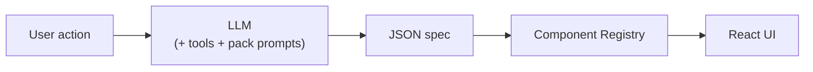

# Onboarding Guide: Creating Packs & Components

This guide walks you through adding new packs and components to Adaptive UI. Read this before writing any code.

## Architecture in 60 Seconds



- The **LLM** decides what to show (JSON spec with `type` fields)
- The **Component Registry** maps `type` strings to React components
- **Packs** bundle components + LLM instructions + optional tools + settings UI
- **Demo apps** register packs and provide a system prompt persona

## Decision: Pack vs Built-in Component

| Want to... | Use |
|---|---|
| Add a general-purpose UI element (layout, input, display) | Built-in component in `builtins.tsx` |
| Add a domain-specific feature with API access | Pack in `src/packs/` |
| Add something that needs settings/credentials | Pack with a settings component |

## Creating a Pack

### 1. File structure

```
src/packs/my-pack/
├── index.ts              # createMyPack() → ComponentPack
├── components.tsx         # Component implementations
└── MyPackSettings.tsx     # Settings UI (optional, for API keys)
```

### 2. Settings (if API key needed)

```typescript
// MyPackSettings.tsx
const STORAGE_KEY = 'adaptive_my_pack_api_key';

export function getStoredApiKey(): string {
  return localStorage.getItem(STORAGE_KEY) ?? '';
}

export function storeApiKey(key: string): void {
  if (key) localStorage.setItem(STORAGE_KEY, key);
  else localStorage.removeItem(STORAGE_KEY);
}

export function MyPackSettings() {
  // Status dot (green/red) + input + save button
  // Use React.createElement(), not JSX
}
```

**Rules:**
- Store credentials in `localStorage`, never in adaptive state
- Export `getStoredApiKey()` for use in components and tool handlers

### 3. Components

```typescript
// components.tsx
import React, { useState, useEffect } from 'react';
import type { AdaptiveComponentProps } from '../../framework/registry';
import type { AdaptiveNodeBase } from '../../framework/schema';
import { useAdaptive } from '../../framework/context';
import { interpolate } from '../../framework/interpolation';

interface MyWidgetNode extends AdaptiveNodeBase {
  type: 'myWidget';
  query: string;         // supports {{state.key}}
  bind?: string;         // state key for selection
  label?: string;
}

export function MyWidget({ node }: AdaptiveComponentProps<MyWidgetNode>) {
  const { state, dispatch, disabled } = useAdaptive();
  const apiKey = getStoredApiKey();
  const [loading, setLoading] = useState(false);

  const query = interpolate(node.query, state);

  useEffect(() => {
    if (disabled) return;          // ← REQUIRED: skip in past turns
    if (!apiKey || !query) return;
    // ... fetch data
  }, [apiKey, query]);

  // ... render
}
```

**Component rules:**
- Use `React.createElement()`, not JSX
- Guard ALL `useEffect` API calls with `if (disabled) return;`
- Use `interpolate()` for dynamic string props
- For API paths referencing `__`-prefixed state keys, pass `{ allowSensitive: true }` as the 5th arg to `interpolate()`
- Check for API key before rendering; show a warning banner if missing

### 4. System prompt (the most important part)

The system prompt teaches the LLM how to use your pack. Follow this three-tier template:

```typescript
const MY_PACK_PROMPT = `
MY PACK:

TOOLS (inference-time, LLM sees results):
- my_api_search: Description. Do NOT use for selection lists — use myPicker instead.

COMPONENTS:

myPicker — {query, bind, label?}
  Client-side selection list. LLM never sees data.
  Example: {type:"myPicker", query:"search term", bind:"selected", label:"Choose"}

myEmbed — {resource, height?}
  Display component.
  Example: {type:"myEmbed", resource:"{{state.selectedItem}}"}

WHEN TO USE:
- my_api_search TOOL: when LLM needs data to make decisions
- myPicker COMPONENT: when user needs to pick from a list
- myEmbed COMPONENT: to display visual content

BEST PRACTICES:
- Use myEmbed after recommendations for visual impact
- Always pair selections with visual feedback
`;
```

**Prompt rules:**
- Document EVERY component with full prop examples
- Tool descriptions must NOT mention "list for selection"
- Include a WHEN TO USE section separating tools from components
- Include BEST PRACTICES for the LLM to follow

### 5. Tools (optional)

```typescript
tools: [
  {
    definition: {
      type: 'function' as const,
      function: {
        name: 'my_tool',
        description: 'What it does. Do NOT use for listing — use myPicker instead.',
        parameters: { type: 'object', properties: { ... }, required: [...] },
      },
    },
    handler: async (args: Record<string, unknown>) => {
      const apiKey = getStoredApiKey();
      if (!apiKey) return 'Error: API key not configured. Ask user to add it in Settings.';
      // ... fetch and return JSON string
      return JSON.stringify(result, null, 2);
    },
  },
],
```

**Tool rules:**
- Check auth/API key first, return clear error if missing
- Return JSON strings (the LLM parses them)
- Slim down responses — avoid sending 5KB per item
- Tool descriptions must not mention "list" or "fetch for selection"

### 6. Pack definition

```typescript
// index.ts
export function createMyPack(): ComponentPack {
  return {
    name: 'my-pack',
    displayName: 'My Pack',
    components: {
      myWidget: MyWidget,
      myPicker: MyPicker,
    },
    systemPrompt: MY_PACK_PROMPT,
    settingsComponent: MyPackSettings,  // optional
    tools: [ ... ],                     // optional
    intentResolvers: { ... },           // optional (Intent mode aliases)
  };
}
```

### 7. Register in a demo app

```typescript
// In the demo app (e.g., TravelApp.tsx)
import { createMyPack } from '../packs/my-pack';
registerPackWithSkills(createMyPack());

// In the AdaptiveApp element, add to visiblePacks:
visiblePacks: ['existing-pack', 'my-pack'],
```

**If you forget `visiblePacks`, your pack's settings panel won't appear!**

## Creating a Built-in Component

For general-purpose components that belong in the framework (not domain-specific):

1. Define the node type interface in `src/framework/schema.ts` (extend `AdaptiveNodeBase`)
2. Add to the `AdaptiveNode` union (before the `AdaptiveNodeBase` fallback)
3. Implement in `src/framework/components/builtins.tsx`
4. Register in `registerBuiltinComponents()` at the bottom
5. Add compact key mappings in `src/framework/compact.ts`
6. Add intent resolver mapping in `src/framework/intent-resolver.ts` if applicable

See the [component-authoring skill](/.github/skills/component-authoring/SKILL.md) for detailed patterns and examples.

## Three-Tier API Pattern

Every pack with API access should use this pattern:

| Tier | Example | When | Token cost |
|------|---------|------|------------|
| **Tool** | `google_places_search` | LLM needs data to reason about (ratings, prices, configs) | ~500-3000 tokens |
| **Picker component** | `googleNearby` | User browses/selects from a list | Zero (client-side) |
| **Display component** | `googleMaps` | Show visual output (maps, charts, embeds) | Zero (client-side) |

**Anti-patterns:**
- Using a tool to fetch 100 items just to put them in a select dropdown → use a picker
- Using a query component for reads → data lands in state but LLM never sees it

## Common Pitfalls

| Pitfall | Fix |
|---------|-----|
| `useEffect` fires in past turns | Guard with `if (disabled) return;` |
| `__`-prefixed keys redacted in API paths | Pass `{ allowSensitive: true }` to `interpolate()` |
| Dropdown clipped by `overflow: hidden` | Active turn container uses `overflow: visible` |
| Settings panel missing for new pack | Add pack name to `visiblePacks` array |
| Self-managed component (login) has no Continue button | Add explicit button using `sendPrompt()` from `useAdaptive()` |
| `String.replaceAll()` used | ES2020 target — use `split().join()` |
| API key stored in state | Store in `localStorage` with module-level getter |
| Tool description mentions "list for selection" | LLM will call the tool instead of emitting a picker |

## Fast-Track: Creating Packs & Components with Copilot

This repo ships with **VS Code Copilot customizations** that automate the boilerplate-heavy parts of pack and component creation. Instead of manually following every step above, you can use built-in prompts, skills, and agents to scaffold code in seconds.

### What's Available

| Type | File | What it does |
|------|------|--------------|
| **Prompt** | `.github/prompts/add-pack.prompt.md` | Scaffolds a complete pack: directory, `createXPack()`, system prompt, components, and demo app registration |
| **Prompt** | `.github/prompts/add-component.prompt.md` | Scaffolds a built-in component: node type, implementation, registration, compact mappings |
| **Skill** | `.github/skills/component-authoring/SKILL.md` | Detailed reference patterns for node interfaces, state binding, children, actions, and compact keys |
| **Agent** | `.github/agents/azure-pack-dev.agent.md` | Specialized agent for Azure pack work (ARM, MSAL, skills resolver) |
| **Instructions** | `.github/instructions/builtins-style.instructions.md` | Auto-applied style rules when editing `builtins.tsx` |
| **Instructions** | `.github/instructions/pitfalls.instructions.md` | Auto-applied pitfall avoidance for all `src/**` files |
| **Instructions** | `.github/instructions/schema-types.instructions.md` | Auto-applied rules when editing `schema.ts` |

### Using Prompts (Fastest Path)

Prompts are one-click scaffolding templates. In VS Code:

1. Open the **Chat panel** (Ctrl+Shift+I / Cmd+Shift+I)
2. Type `/` to see available prompts, or attach one with `#prompt`
3. Select **add-pack** or **add-component**
4. Provide the argument (e.g., `spotify — music player with playlist browsing and track preview`)
5. Copilot generates all files, registers the pack, and runs `npm run build` to verify

**Example — create a Spotify pack:**
```
/add-pack spotify — music player with playlist browsing and track preview
```

This generates:
- `src/packs/spotify/index.ts` — `createSpotifyPack()` with system prompt and tool definitions
- `src/packs/spotify/components.tsx` — component implementations
- `src/packs/spotify/SpotifySettings.tsx` — API key settings UI
- Registration code in the target demo app

**Example — add a built-in stepper component:**
```
/add-component stepper — shows numbered steps with active/completed states
```

This generates changes across `schema.ts`, `builtins.tsx`, `compact.ts`, and optionally `intent-resolver.ts`.

### Using the Component Authoring Skill

The skill at `.github/skills/component-authoring/SKILL.md` is automatically loaded by Copilot when your request involves adding components. It provides:

- Exact interface patterns (display-only, state-binding, container, action)
- `React.createElement()` templates matching the codebase style
- Registration and compact key mapping instructions
- Intent resolver integration guidance

You don't need to reference it manually — Copilot loads it when relevant. But you can read it directly for a quick reference on all component patterns.

### Using Agents

The `azure-pack-dev` agent is a specialized Copilot agent for Azure pack work. Invoke it when you need to:

- Add new Azure components or resource type support
- Modify ARM introspection or MSAL auth
- Update the skills resolver triggers
- Work on any file in `src/packs/azure/`

In Chat, select the **azure-pack-dev** agent or mention `@azure-pack-dev` to route your request to it.

### Instructions (Auto-Applied)

Instruction files in `.github/instructions/` are automatically applied based on `applyTo` patterns — you don't need to do anything. They enforce:

- **`builtins-style`** → `React.createElement()` style, dispatch patterns, CSS conventions (when editing `builtins.tsx`)
- **`pitfalls`** → ES2020 target compliance, `disabled` guard checks, `localStorage` for secrets (when editing any `src/**` file)
- **`schema-types`** → `AdaptiveNodeBase` extension, literal type fields, union ordering (when editing `schema.ts`)

### Creating Your Own Customizations

You can add more prompts, skills, agents, and instructions following the same patterns:

| To create | Add file at | Format |
|-----------|-------------|--------|
| A new prompt | `.github/prompts/<name>.prompt.md` | YAML frontmatter + task template with `$input` placeholder |
| A new skill | `.github/skills/<name>/SKILL.md` | YAML frontmatter + step-by-step procedure |
| A new agent | `.github/agents/<name>.agent.md` | YAML frontmatter + persona + domain knowledge |
| New instructions | `.github/instructions/<name>.instructions.md` | YAML frontmatter with `applyTo` glob + rules |

See the [VS Code Copilot customization docs](https://code.visualstudio.com/docs/copilot/copilot-customization) for details on frontmatter fields and `applyTo` patterns.

## Existing Packs as Reference

| Pack | Best example of |
|------|-----------------|
| `azure` | Full-featured pack: auth, pickers, query, forms, tools, skills, intent resolvers |
| `github` | OAuth Device Flow, auto-pagination, PR creation, CORS proxy |
| `google-maps` | Display components (maps, photos), client-side Places API, geocoding |
| `google-flights` | Protobuf encoding, HTML parsing, graceful fallback (link mode) |
| `travel-data` | No-API-key tools (free APIs), visual data cards, interactive widgets |
